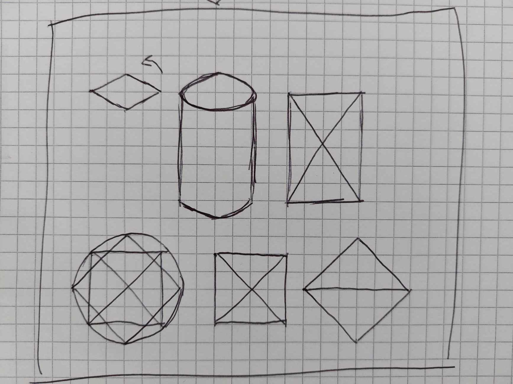
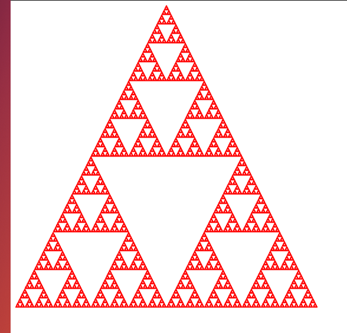

*Námskeið: Tölvugrafík*

*Nemandi: Jóhannes Nordal*

*Netfang: jon8@hi.is*

# Heimadæmi 1

## Dæmi 1

Það er hægt að teikna öll form með bara þríhyrningum. Segjum að við viljum
teikna hring þá er hægt að leggja *N* marga þríhyrninga hver ofan á annan
og snú hverjum og einum *X* gráður. Hvernig hægt er að teikna kassa
ætti að vera augljóst fyrir öllum. Myndin hér að neðan sýnir betur
hvernig þetta er hægt.



## Dæmi 2

### a)

Innri bandvídd er allt upp að 960 GB/s.

### b)

Lithraði skjápunkta er allt upp að 480 GP/s.

### c)

16 GT/s.

### d)

Hámarks skjáupplausn er 4K.

## Dæmi 3

WebGPU er JavaScript forritunarsafn sem keyrir í vafra og hefur aðgang að
grafíkkorti tölvunnar. Þetta hjálpar að sjálfsögðu við myndvinnslu, bæði tví- og
þrívíða, en einnig öll forrit sem geta nýtt GPU, t.d., gervigreind.

## Dæmi 4

glTF er stöðluð skráargerð (e. *file format*) sem notuð er til að geyma grafíkgögn.
Hægt er að geyma bæði JSON, sem er algengast, eða binary gögn.

## Dæmi 5

Ég hækkaði punktanna upp í 500000.

```js
var NumPoints = 500000;
```


